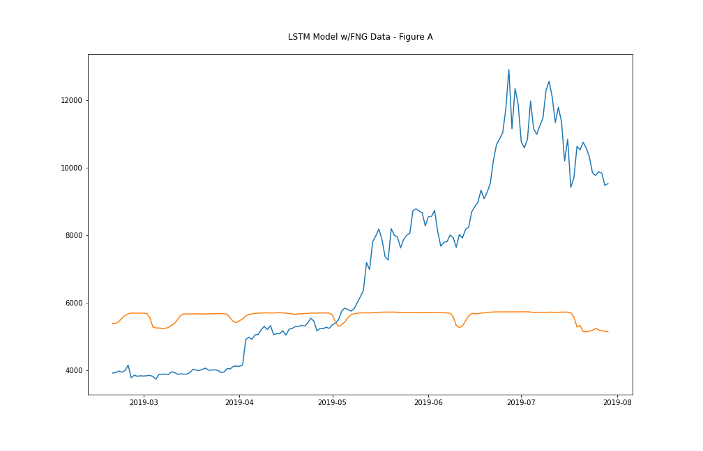
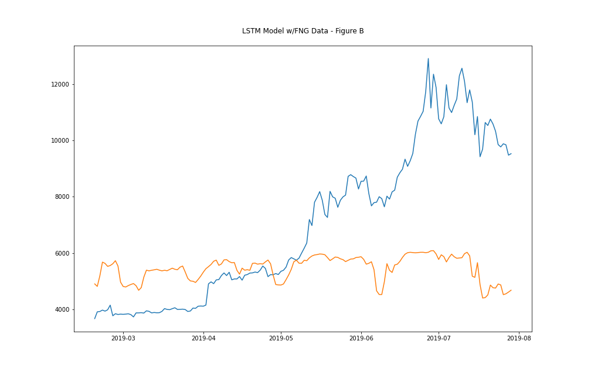
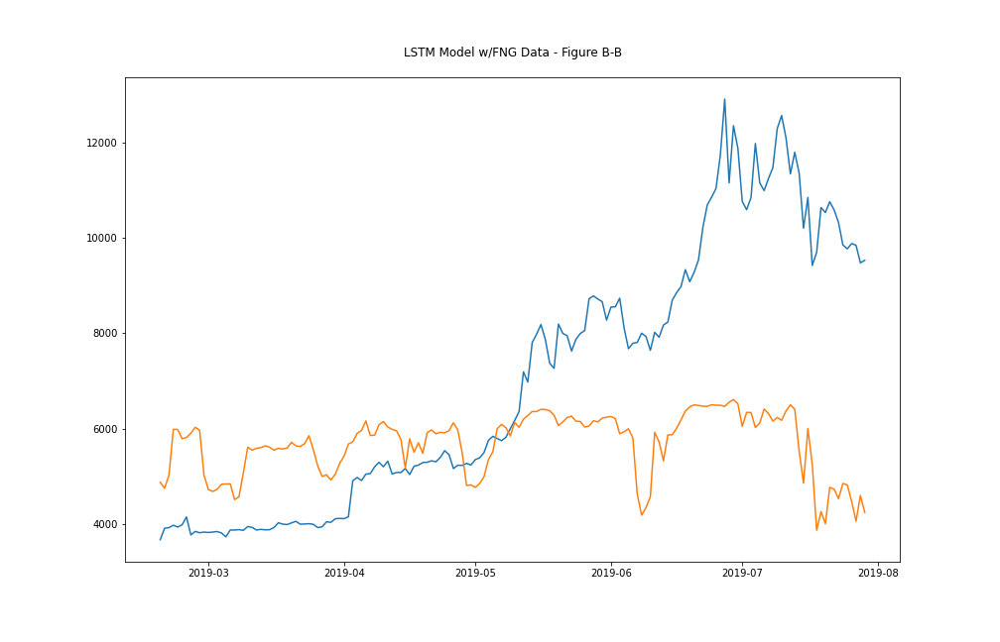
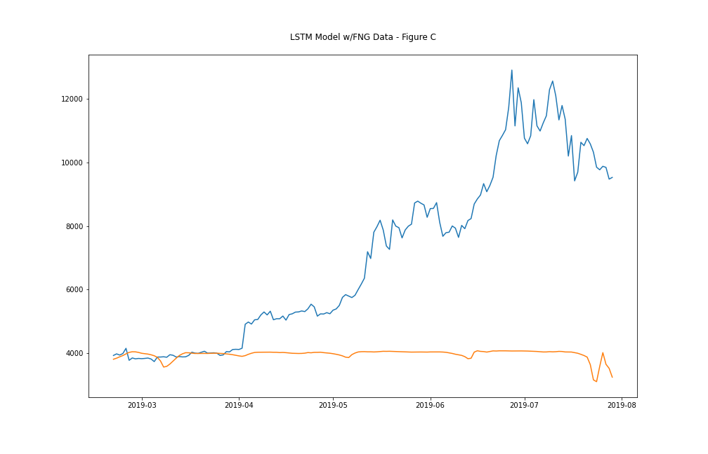
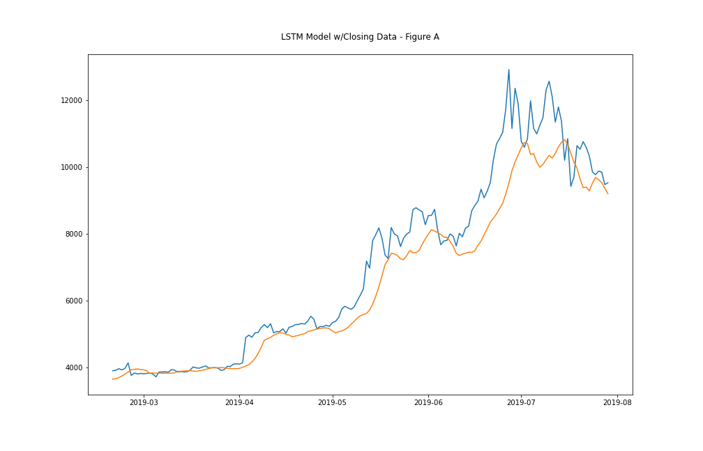
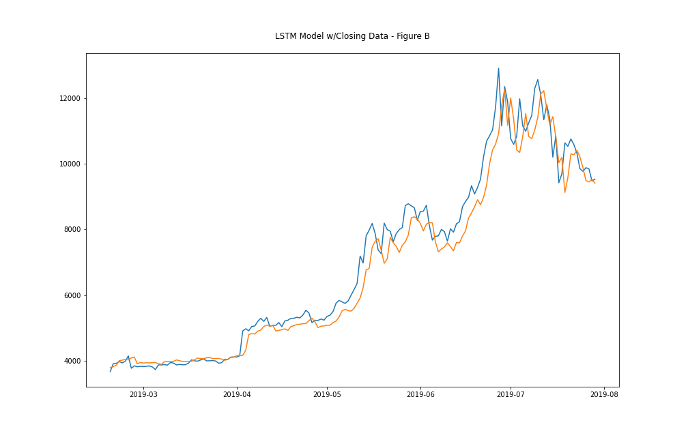
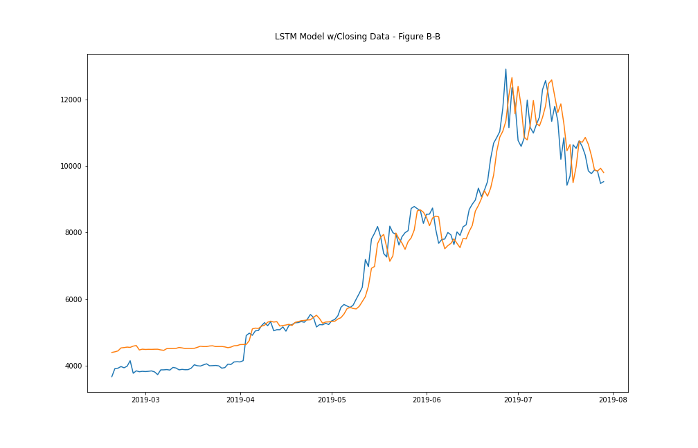
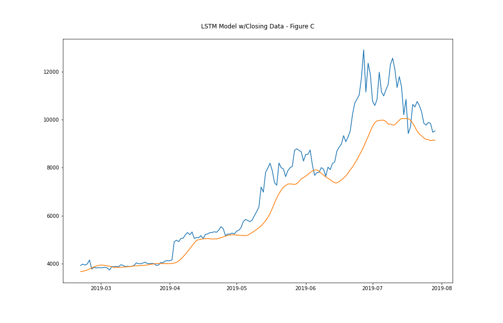

# fintech-crypto-deep-learning

This project is part of my Fintech homework in which I use a deep learning model to predict the price of bitcoin, given pricing data and sentiment analysis as an indicator (in ML terms, an additional feature).

---
## Instructions / Intro

This Project consists of two Jupyter Notebooks, both of which run through a sequence of steps to prepare the data and then use the model to predict closing prices of Bitcoin.  

In order to make best use of this project, either:
- Read through the conclusions drawn from the experiments within this document and then work through each of the Notebooks ... or
- Work through the Notebooks, draw your own conclusions and contrast with those drawn below.

### Some Terms Used

- RNN:  Recurrent Neural Network - an aritificial neural network in which the output of a node becomes an input into the next.
- LSTM: Long Short Term Memory - a term describing this specific recurrent neural network (RNN) model, i.e. LSTM, which overcomes the short term memory problem; a well known problem with "traditional" RNNs.
- FNG: Crypto Fear and Greed Index - an index, made available through an API by the wonderful folks at alternative.me (see more below).

### Notebooks

- [`lstm_stock_predictor_closing.ipynb`](lstm_stock_predictor_closing.ipynb) - a Notebook that uses Bitcoin (BTC) closing prices.
- [`lstm_stock_predictor_fng.ipynb`](lstm_stock_predictor_fng.ipynb) - a Notebook that uses crypto-based fear and greed sentiment analysis.

To run through either Notebook, load it up in Google Colab or Jupyter Labs and run through it looking at the data prep, the model building, execution and final visualisation(s).

---
## Deep Learning Model

Both Notebooks explore the use (or benefits) of using the long short term (LSTM) recurrent neural network (RNN) model.  As briefly described in the ["Terms"](#some-terms-used) above, LSTMs are RNNs but without the limitations of trasitional RNNs

### Model Differences

As has been aluded to in earlier sections, the differences between the two approaches are:
- **LSTM with closing price data**:  this model is an artificial neural network that uses the closing prices of Bitcoin to help predict prices.
- **LSTM with fear and greed sentiment analysis data**:  this model is also an artificial neural network, but instead uses FNG data in order to determine predicted prices.

## Model Performance Evaluation

The performance of the models and their differing data inputs are briefly explained in the Q&A: -

***Which model has a lower loss?***  
The model with the lowest loss is the LSTM model using BTC closing data.  By far!!!!!! 

***Which model tracks the actual values better over time?***  
Most definitely the LSTM model using BTC closing data.

***Which window size works best for the model?***  
For the best model - being the LSTM w/BTC closing data - the window that seems to work best (although I've not by any means exhaustively determined the best window) is the shortest window!  In other words, the shorter the window, the low the loss (the better it performed).  The window is the biggest factor in ensuring the lowest loss. As is evident in the results table below (and graphs available to view) that some surrounding factors, e.g. dropout, input units, etc, while having a bearing on the results, were not as effective as ensuring the window size is correct for the tests being conducted.

- *Note: For these results, the model fitting constants for **ALL** tests were: -*
  - Epochs: 15 (I found 10 epochs to be more effective, but stuck with 15)
  - Layer 1 inputs: 30 (I had varying results with inputs so left them at this number, although in the table below, the difference is fairly stark when the shape and units are kept the same.
  - Batch size: 1 (Varying the batch size any greater seemed to not yield any better results)
  - Dropouts: Using models that are configured for dropouts are important because they help with resisting overfitting.  In my evaluations below, I explore with and without dropouts as I indicate below.

| RNN model | Loss | Dropout | Dropout % | Window | Units | Fig.
| -: | :-: | :-: | :-: | :-: | :-: | :-:
| LSTM w/FNG sentiment data | 0.109177 | No | - | 1 | 30 |
|  | 0.109121 | No | - | 5 | 30 |
|  | 0.108491 | No | - | 7 | 30 |
|  | 0.106267 | No | - | 10 | 30 |
|  | 0.111268 | Yes | 5 | 6 | 30 | [FNG-A](#fng-figure-a)
|  | 0.106926 | Yes | 5 | 6 | 18 |
|  | 0.109231 | Yes | 5 | 2 | 30 | [FNG-B](#fng-figure-b)
|  | 0.101559 | Yes | 5 | 2 | 6 | [FNG-B-B](#fng-figure-b-b)
|  | 0.199749 | Yes | 5 | 10 | 30 | [FNG-C](#fng-figure-c)
| LSTM w/BTC "close" pricing | 0.003468 | No | - | 1 | 30 |
|  | 0.007630 | No | - | 5 | 30 |
|  | 0.010191 | No | - | 7 | 30 |
|  | 0.013564 | No | - | 10 | 30 |
|  | 0.008897 | Yes | 5 | 6 | 30 | [BTC-A](#btc-figure-a)
|  | 0.006991 | Yes | 5 | 6 | 18 |
|  | 0.003549 | Yes | 5 | 2 | 30 | [BTC-B](#btc-figure-b)
|  | 0.003742 | Yes | 5 | 2 | 6 | [BTC-B-B](#btc-figure-b-b)
|  | 0.013401 | Yes | 5 | 10 | 30 | [BTC-C](#btc-figure-c)

### FNG Figure A

### FNG Figure B

### FNG Figure B-B

### FNG Figure C

### BTC Figure A

### BTC Figure B

### BTC Figure B-B

### BTC Figure C

---
## Acknowledgements
### Sources
- More on the FNG index found [here](https://alternative.me/crypto/fear-and-greed-index/)
- Both "Starter Notebooks" provided by Trinity College as part of course work, which are built upon.
- The Keras Deep Learning Library was used; find more [here](https://keras.io/about/).
- [TensorFlow](https://github.com/tensorflow/tensorflow) is the open-source machine learning platform upon which Keras is built.
- More on the Sci-kit Learn library [here](https://scikit-learn.org/stable/about.html)

### Licenses
N/A